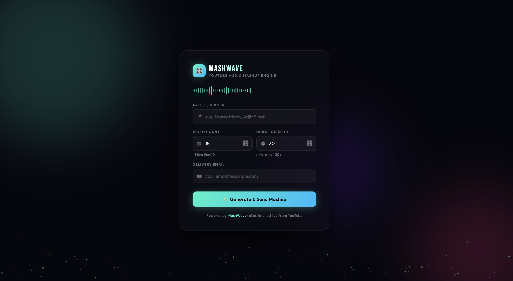

# YouTube Audio Mashup 🎵

[](https://pypi.org/project/Mashup-Gurdarshan-102303217/)
[](https://mashup-music.vercel.app/)

A powerful dual-interface utility that downloads videos from YouTube, extracts the audio, cuts them to a specific duration, and merges them into a single, seamless audio mashup.

Created by **Gurdarshan Singh** (Roll No: 102303217).

🌐 **Live Web App:** [https://mashup-music.vercel.app/](https://mashup-music.vercel.app/)  
📦 **PyPI Package:** [Mashup-Gurdarshan-102303217](https://pypi.org/project/Mashup-Gurdarshan-102303217/)

---

## 📸 Web Interface
*(Screenshot of the beautiful UI)*


---

## 🚀 Features
- **Automated Searching:** Pass the singer/artist name, and it automatically finds the top videos.
- **Direct Audio Extraction:** Uses `yt-dlp` to download high-quality audio directly.
- **Precision Trimming:** Cuts the first `Y` seconds from every downloaded track using `pydub`.
- **Seamless Merging:** Combines all trimmed clips into one clean `.mp3` output file.

---

## 💻 Interface 1: The Web App (Recommended)
You don't need to install anything to use the web version. 
Just visit the live link, enter the details, and the server will process the mashup for you!

👉 **[Try the Web App Here](https://mashup-music.vercel.app/)**

---

## ⌨️ Interface 2: The Command Line Tool (CLI)
For developers who want to run the tool locally on their own machines.

### Prerequisites
This tool relies on `pydub` to process audio, which requires **FFmpeg** to be installed on your system.
* **Mac:** `brew install ffmpeg`
* **Linux:** `sudo apt-get install ffmpeg`
* **Windows:** Download from [FFmpeg official site](https://ffmpeg.org/download.html) and add it to your PATH.

### Installation
Install the package directly from PyPI:
```bash
pip install Mashup-Gurdarshan-102303217
```

### Usage
Once installed, use the globally available `mashup` command:
```bash
mashup <SingerName> <NumberOfVideos> <AudioDurationInSeconds> <OutputFileName.mp3>
```

**Example:**
```bash
mashup "Arjan Dhillon" 15 20 my_mashup.mp3
```
*(Note: Number of videos must be > 10, and Audio Duration must be > 20 seconds).*

---

## 📝 License
This project was built for educational purposes.
